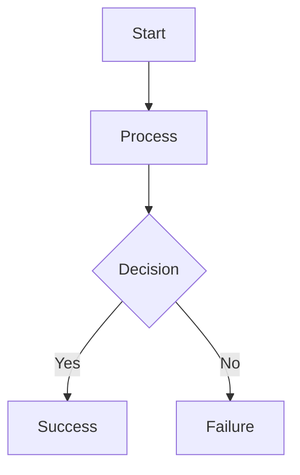

# GitHub Productivity Secrets: Mastering Workflows for Modern Developers

With over 100 million developers and 330 million repositories, [GitHub](https://github.com) has become the world's largest platform for software development. Yet many users only scratch the surface of what GitHub offers. In this guide, we'll explore lesser-known features and workflows that can dramatically improve your productivity as a developer.

## Beyond Basic Git: Advanced GitHub Features

### 1. GitHub CLI: Command-Line Power

The [GitHub CLI](https://cli.github.com/) brings GitHub's functionality to your terminal, enabling you to:

```bash
# Create a pull request
gh pr create --title "Fix login bug" --body "Resolves issue #42"

# View and check out pull requests
gh pr list
gh pr checkout 123

# Create and view issues
gh issue create
gh issue list --assignee @me

# Run GitHub Actions workflows
gh workflow run deploy.yml
```

Try combining GitHub CLI with aliases and shell scripts to automate repetitive tasks further.

### 2. GitHub Codespaces: Development Environments in Seconds

[GitHub Codespaces](https://github.com/features/codespaces) provides cloud-based development environments that are:

- Preconfigured with your project's dependencies
- Accessible from anywhere with an internet connection
- Customizable via a `.devcontainer.json` file

```json
// .devcontainer/devcontainer.json
{
  "name": "Python 3",
  "image": "mcr.microsoft.com/devcontainers/python:3.10",
  "extensions": [
    "ms-python.python",
    "ms-python.vscode-pylance"
  ],
  "postCreateCommand": "pip install -r requirements.txt"
}
```

Codespaces can save hours of setup time, especially when onboarding new team members or working across multiple devices.

### 3. Advanced Code Navigation

GitHub now offers IDE-like code navigation features:

- **Go to definition**: Click on a function or class name while pressing the "Alt" key
- **Find all references**: See everywhere a symbol is used
- **Symbol search**: Press "T" in any code file to search for functions, classes, etc.
- **Code search**: Use GitHub's powerful [code search](https://github.com/search) to find code patterns across repositories

## Collaboration Superpowers

### 1. GitHub Projects: Beyond Basic Kanban

The new [GitHub Projects](https://docs.github.com/en/issues/planning-and-tracking-with-projects) offers:

- Custom fields for better issue organization
- Multiple views (board, table, roadmap)
- Automated workflows
- Integration with issues and pull requests

For example, you can create custom fields to track priority, effort, or any other metadata relevant to your team:

```
Priority: [High, Medium, Low]
Effort: [Small, Medium, Large]
Sprint: [Current, Next, Backlog]
```

### 2. Pull Request Templates and Automation

Create templates to standardize pull request descriptions:

```markdown
<!-- .github/PULL_REQUEST_TEMPLATE.md -->
## Description
<!-- Describe your changes in detail -->

## Related Issue
<!-- Link to the issue this PR addresses -->
Fixes #

## Type of change
- [ ] Bug fix
- [ ] New feature
- [ ] Breaking change
- [ ] Documentation update

## How Has This Been Tested?
<!-- Describe how you tested your changes -->

## Checklist:
- [ ] My code follows the project's style guidelines
- [ ] I have performed a self-review of my own code
- [ ] I have added tests that prove my fix/feature works
- [ ] Documentation has been updated
```

Combine this with [GitHub Actions](https://github.com/features/actions) to automate code reviews, testing, and deployment:

```yaml
# .github/workflows/pull-request.yml
name: Pull Request Checks

on:
  pull_request:
    branches: [ main ]

jobs:
  test:
    runs-on: ubuntu-latest
    steps:
      - uses: actions/checkout@v3
      - name: Set up Node.js
        uses: actions/setup-node@v3
        with:
          node-version: '18'
      - name: Install dependencies
        run: npm ci
      - name: Run tests
        run: npm test
      - name: Run linting
        run: npm run lint
```

### 3. Code Ownership and Reviews

Define code owners to automatically assign reviewers:

```
# .github/CODEOWNERS
# Global owners
*       @team-leads

# Frontend code
/frontend/  @frontend-team

# Backend code
/backend/   @backend-team

# Documentation
*.md        @docs-team
```

Use [protected branches](https://docs.github.com/en/repositories/configuring-branches-and-merges-in-your-repository/defining-the-mergeability-of-pull-requests/about-protected-branches) to enforce code review policies and maintain code quality.

## GitHub Actions: Automation at Its Best

GitHub Actions can automate virtually any development workflow:

### 1. Continuous Integration and Deployment

```yaml
# .github/workflows/deploy.yml
name: Deploy to Production

on:
  push:
    branches: [ main ]

jobs:
  deploy:
    runs-on: ubuntu-latest
    steps:
      - uses: actions/checkout@v3
      
      - name: Set up Node.js
        uses: actions/setup-node@v3
        with:
          node-version: '18'
          
      - name: Install dependencies
        run: npm ci
        
      - name: Build
        run: npm run build
        
      - name: Deploy to production
        uses: some-deployment-action@v1
        with:
          api-key: ${{ secrets.DEPLOY_API_KEY }}
```

### 2. Scheduled Tasks

```yaml
# .github/workflows/scheduled.yml
name: Weekly Dependency Updates

on:
  schedule:
    - cron: '0 0 * * 1'  # Runs at midnight on Monday

jobs:
  update-dependencies:
    runs-on: ubuntu-latest
    steps:
      - uses: actions/checkout@v3
      
      - name: Update dependencies
        run: |
          npm update
          git config user.name github-actions
          git config user.email github-actions@github.com
          git add package.json package-lock.json
          git commit -m "Update dependencies" || echo "No changes to commit"
          git push
```

### 3. Custom Automation

```yaml
# .github/workflows/issue-triage.yml
name: Issue Triage

on:
  issues:
    types: [opened]

jobs:
  triage:
    runs-on: ubuntu-latest
    steps:
      - uses: actions/github-script@v6
        with:
          script: |
            const body = context.payload.issue.body;
            
            // Add labels based on issue content
            if (body.includes('bug')) {
              github.rest.issues.addLabels({
                issue_number: context.issue.number,
                owner: context.repo.owner,
                repo: context.repo.repo,
                labels: ['bug', 'triage-needed']
              });
            }
            
            // Assign to team members
            if (body.includes('frontend')) {
              github.rest.issues.addAssignees({
                issue_number: context.issue.number,
                owner: context.repo.owner,
                repo: context.repo.repo,
                assignees: ['frontend-lead']
              });
            }
```

## Repository Management at Scale

### 1. Repository Templates

Create [repository templates](https://docs.github.com/en/repositories/creating-and-managing-repositories/creating-a-template-repository) to standardize new projects:

1. Create a repository with your standard files:
   - License and README
   - GitHub Actions workflows
   - Issue and PR templates
   - Standard directory structure
   - Configuration files

2. Click "Settings" > "Template repository"

3. Use the template to create new repositories with the same structure

### 2. GitHub Apps and Integrations

[GitHub Marketplace](https://github.com/marketplace) offers hundreds of integrations:

- **[Dependabot](https://github.com/dependabot)**: Automated dependency updates
- **[CodeQL](https://github.com/github/codeql-action)**: Advanced security analysis
- **[Codecov](https://github.com/marketplace/codecov)**: Code coverage reports
- **[Stale](https://github.com/marketplace/stale)**: Automatically close inactive issues

For example, add Dependabot to your repository with a simple configuration:

```yaml
# .github/dependabot.yml
version: 2
updates:
  - package-ecosystem: "npm"
    directory: "/"
    schedule:
      interval: "weekly"
    open-pull-requests-limit: 10
    
  - package-ecosystem: "github-actions"
    directory: "/"
    schedule:
      interval: "monthly"
```

### 3. GitHub API for Custom Tooling

The [GitHub API](https://docs.github.com/en/rest) enables you to build custom tools:

```javascript
// Example: Script to find inactive repositories
const { Octokit } = require("@octokit/rest");
const octokit = new Octokit({ auth: process.env.GITHUB_TOKEN });

async function findInactiveRepos(org, days) {
  const date = new Date();
  date.setDate(date.getDate() - days);
  const since = date.toISOString();
  
  const { data: repos } = await octokit.repos.listForOrg({
    org,
    type: 'all'
  });
  
  for (const repo of repos) {
    const { data: commits } = await octokit.repos.listCommits({
      owner: org,
      repo: repo.name,
      since,
      per_page: 1
    });
    
    if (commits.length === 0) {
      console.log(`Inactive repo: ${repo.name} (Last updated: ${repo.updated_at})`);
    }
  }
}

findInactiveRepos('your-organization', 90);
```

## Security Features You Should Be Using

GitHub offers robust security features that every developer should leverage:

### 1. Dependabot Security Updates

Enable automated security updates:

```yaml
# .github/dependabot.yml
version: 2
updates:
  - package-ecosystem: "npm"
    directory: "/"
    schedule:
      interval: "daily"
    open-pull-requests-limit: 10
    # Enable security updates
    allow:
      - dependency-type: "all"
```

### 2. Secret Scanning

GitHub automatically scans repositories for accidentally committed secrets like API keys and access tokens. Configure custom patterns for your organization's secrets:

```yaml
# .github/secret_scanning.yml
paths-ignore:
  - "**/*.test.js"
  - "**/test/**"
```

### 3. Code Scanning with CodeQL

Detect vulnerabilities with [CodeQL](https://codeql.github.com/):

```yaml
# .github/workflows/codeql-analysis.yml
name: "CodeQL"

on:
  push:
    branches: [ main ]
  pull_request:
    branches: [ main ]
  schedule:
    - cron: '0 0 * * 0'

jobs:
  analyze:
    name: Analyze
    runs-on: ubuntu-latest
    permissions:
      security-events: write
      
    steps:
    - name: Checkout repository
      uses: actions/checkout@v3
      
    - name: Initialize CodeQL
      uses: github/codeql-action/init@v2
      with:
        languages: javascript, python
        
    - name: Perform CodeQL Analysis
      uses: github/codeql-action/analyze@v2
```

## Hidden Productivity Gems

### 1. Keyboard Shortcuts

Press `?` on any GitHub page to see available shortcuts. Some essential ones:

- `g c`: Go to code
- `g i`: Go to issues
- `g p`: Go to pull requests
- `t`: Activate file finder
- `y`: Convert URL to canonical form (useful for sharing links to specific code lines)

### 2. Advanced Search Techniques

GitHub's search is incredibly powerful when you know the syntax:

```
# Find security issues in your code
"API_KEY" language:javascript org:your-organization

# Find TODO comments in the codebase
TODO in:file language:python

# Find recently updated repositories
org:your-organization pushed:>2023-01-01

# Find help wanted issues
is:issue is:open label:"help wanted" language:rust
```

### 3. Markdown Tricks

GitHub's flavored markdown offers unique features:

- **Task lists**: `- [ ] Todo item` becomes a clickable checkbox
- **Auto-linking issues**: `#123` links to issue/PR number 123
- **@mentions**: `@username` notifies the user
- **Emojis**: `:rocket:` becomes 🚀 (see the [full list](https://github.com/ikatyang/emoji-cheat-sheet))
- **Diagrams**: Create Mermaid diagrams directly in markdown:



## Community and Learning Resources

### 1. GitHub Learning Lab

[GitHub Learning Lab](https://lab.github.com/) offers interactive courses on GitHub, Git, and development best practices.

### 2. GitHub Skills

[GitHub Skills](https://skills.github.com/) provides hands-on learning experiences with GitHub workflows.

### 3. GitHub Discussions

[GitHub Discussions](https://docs.github.com/en/discussions) creates a community space for questions, ideas, and announcements beyond the scope of issues.

### 4. GitHub Copilot

[GitHub Copilot](https://github.com/features/copilot) is an AI pair programmer that suggests code as you type, leveraging OpenAI's language models.

## Conclusion

GitHub offers far more than just Git repository hosting. By leveraging these advanced features and workflows, you can significantly boost your productivity, improve collaboration, and maintain higher quality code.

Start by implementing one or two of these techniques in your workflow. Over time, build up to a fully optimized GitHub experience tailored to your team's needs.

What are your favorite GitHub productivity tips? Share them in the comments below!